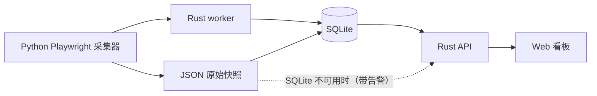

# 罗盘经营看板

面向抖音电商罗盘的低频采集与经营看板：Rust 提供登录、API 和生产看板，Python 负责 Playwright 采集，前端展示经营、库存、结算和采集状态。

## 常用命令

先运行 `make help` 查看全部入口；日常开发通常只需以下命令：

| 目的 | 命令 |
| --- | --- |
| 完整检查（Rust、前端、Python） | `make check` |
| 构建生产静态文件 | `make build` |
| 启动本地看板 API | `make dashboard` |
| 启动前端开发服务器 | `make web` |
| 执行一次日常采集 | `make daily` |
| 启停 Docker 服务 | `make docker-up` / `make docker-down` |

前端的 HTML、TypeScript 和 CSS 只在 `apps/web/` 中维护；`web/static/` 是构建结果，不直接编辑。完整目录职责见 [docs/architecture.md](./docs/architecture.md)。

## 快速部署（Docker）

### 1. 配置、构建并启动服务

启动前复制环境示例，并设置不少于 12 位且不等于 `admin123` 的管理员密码：

```bash
cp .env.example .env
ADMIN_PASSWORD="请替换为强密码"
cp config/shops.example.json config/shops.local.json
```

然后构建并启动：

```bash
docker compose build
docker compose up -d
```

也可以使用统一入口：

```bash
make docker-up
```

容器会拒绝空密码、`admin123` 和少于 12 位的密码。
Compose 默认仅在宿主机 `127.0.0.1` 映射看板 `8501` 和 noVNC `6080`，不需要预先创建 Docker 网络。可通过 `.env` 中的 `LUOPAN_HOST_BIND`、`LUOPAN_DASHBOARD_PORT` 和 `LUOPAN_NOVNC_PORT` 调整；只有在配置了防火墙或额外认证时才应把 `LUOPAN_HOST_BIND` 改为 `0.0.0.0`。

生产环境请在 HTTPS 反向代理后访问看板。`SESSION_COOKIE_SECURE=true` 是默认且强制的生产设置；只有本地开发脚本会显式关闭它。
将 `config/shops.local.json` 中的示例店铺替换为真实店铺；该文件已被忽略，不会提交到公开仓库。

### 2. 首次登录

1. 通过 HTTPS 反向代理打开数据看板：`https://YOUR_DOMAIN`
2. 使用管理员账户登录：
   - 用户名：`admin`
   - 密码：启动前在 `.env` 中设置的 `ADMIN_PASSWORD`
3. 首次登录后可在“账户设置”修改密码。
4. 如需添加其他用户，管理员可在“账户设置”中添加；`viewer` 账户只能查看数据。

### 3. 访问服务

- **数据看板/API 服务**: `https://YOUR_DOMAIN`（生产环境需要登录）
- **独立采集服务 noVNC**: 通过受访问控制的 HTTPS 反向代理访问，例如 `https://YOUR_DOMAIN/novnc/`（用于扫码登录抖音）。默认端口仅绑定宿主机 `127.0.0.1`，不应直接暴露。

Compose 会启动 `compass-dashboard` 与 `compass-collector` 两个容器。前者只负责账户、API 和看板，后者独立持有 Chromium、采集队列、定时任务和 noVNC；两者通过持久化目录共享任务状态与采集结果。

### 4. 定时任务

- 每天 9:00 自动触发采集任务
- 任务内部随机等待 0-60 分钟，避免固定时间访问
- 如果登录失效，看板会显示登录截图和 noVNC 入口
- 登录完成后任务会自动继续执行

详细部署说明请参考 [DEPLOY.md](./DEPLOY.md)

---

## 本地运行

### 首次准备

```bash
curl -LsSf https://astral.sh/uv/install.sh | sh
uv sync --locked
uv run python -m playwright install chromium
pnpm -C apps/web install
```

项目的 Python 依赖由 `pyproject.toml` 和提交到 Git 的 `uv.lock` 统一管理。不要再使用 `pip install -r requirements.txt`；新增或升级依赖时运行 `uv add <包名>` 或 `uv lock`，并一并提交更新后的锁文件。

### 每日运行

```bash
make daily
```

脚本会打开有头浏览器。如果出现登录页，请手动扫码登录；登录态会保存在 `session/`，后续通常可以复用。

公开演示使用以下脱敏店铺名称；真实店铺配置应保存在未纳入版本控制的 `config/shops.local.json`：

- 店铺 A
- 店铺 B
- 店铺 C
- 店铺 D

也可以只抓某一家：

```bash
./scripts/run_daily.sh --shop "店铺 A"
```

## 输出

结果会写到：

```text
output/daily/<数据日期>/
output/channel/<数据日期>/
output/collection/
```

每次运行会生成一份 JSON 和一份 CSV，例如：

```text
output/daily/2026-06-11/compass_daily_2026-06-11_143000.json
output/daily/2026-06-11/compass_daily_2026-06-11_143000.csv
```

脚本完成后可以启动数据看板：

```bash
make dashboard
```

看板默认地址：

```text
http://127.0.0.1:8501
```

首次访问需要登录：
- 用户名：`admin`
- 密码：启动前在 `.env` 中设置的 `ADMIN_PASSWORD`

登录后可以在“账户设置”修改密码；管理员还可以添加或删除用户。

当前生产看板由 Rust API 直接提供登录、静态文件和业务 API，并优先读取 SQLite；Rust worker 采集成功后会同步 SQLite，新跑出的每日数据会自动进入看板。

“采集中心”是独立入口：管理员可单独采集经营模块或渠道模块，查看采集服务在线状态、队列、各模块最近结果与终端日志。业务看板刷新只读取本地 SQLite/JSON，不会触发浏览器采集。

部署后可以用一条命令检查核心状态：

```bash
docker exec -it douyin-compass luopan-worker-rs doctor
```

前端本地开发时，在两个终端分别启动 Rust API 和 Vite：

```bash
make dashboard
# 新开一个终端
make web
```

然后打开 `http://127.0.0.1:5173`；Vite 会将 `/api` 请求代理到本地 Rust API。

## 订单数据

订单明细上传、Rust Excel 解析、预览、确认写入和撤销都在当前数据看板中完成。

## 结算数据

抖音结算导出的 `DL*.csv` 可以直接在“结算看板”上传，上传时填写店铺名称；也可以放到 `output/settlement/` 后由 Rust API 自动读取。金额按 CSV 原始元单位展示，页面支持按店铺筛选。公开版本不包含真实结算文件名映射：

- `*xxxx.csv`：店铺 A
- `*yyyy.csv`：店铺 B

```bash
mkdir -p output/settlement
cp DL*.csv output/settlement/
docker exec -it douyin-compass luopan-worker-rs settlement-json
docker exec -it douyin-compass luopan-worker-rs settlement-json --shop "店铺 A"
```

旧的独立 HTML/Streamlit 入口已归档到 `legacy/`，不再作为生产路径。

## 架构与数据流



系统以 SQLite 作为在线读取源，JSON 保留为原始快照与受控回退来源。接口响应会标明 `source`、`fallback` 与 `updated_at`，便于识别数据新鲜度。

## 许可证与使用限制

本仓库仅用于项目展示，未经授权不得复制或用于商业用途。

## 低频策略

脚本默认使用可见浏览器、人工登录、动作慢速、点击前后随机等待，并且每家店铺之间预留额外等待。它不是高速采集器，也不绕过平台风控；如果页面加载慢，宁愿多等一会。

可选参数：

```bash
./scripts/run_daily.sh --login-timeout-minutes 15 --keep-open
```

`--keep-open` 会在完成后保留浏览器 60 秒，方便人工检查。
